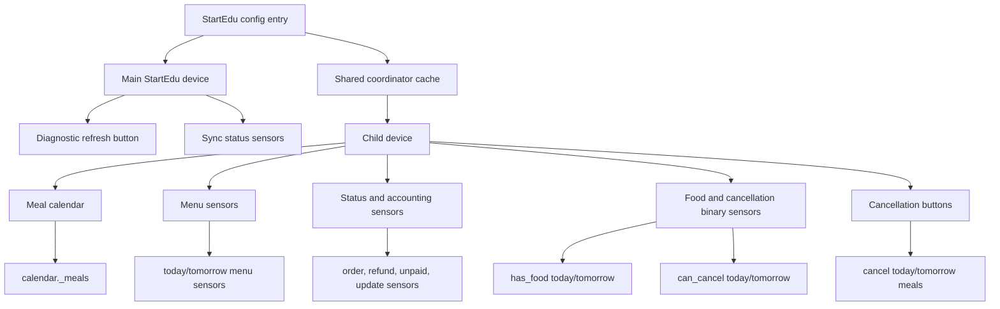
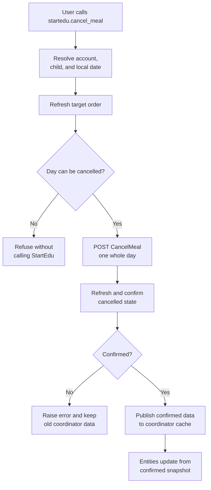

# Home Assistant Entity Model

This document defines the target entity model for StartEdu. It is based on the
read-only discovery notes in `docs/startedu-flow-discovery.md` and focuses on
Home Assistant usefulness while keeping mutating actions explicit and guarded.

## Device Model

Each StartEdu child is represented as a separate Home Assistant device.

- Device identifier: `(startedu, <config_entry_id>, <client_id>)`
- Device name: child display name from StartEdu
- Device manufacturer: `StartEdu`

All child-specific entities belong to the child device. This keeps dashboards
and automations clear for multi-child accounts.



## Calendar

Each child gets one calendar:

```text
calendar.<child>_meals
```

Calendar rules:

- Every meal slot is a separate event.
- Supported slot types are `breakfast`, `lunch`, `afternoon_snack`, and `other`.
- Event summary is the meal slot name, such as `Obiad`.
- Cancelled event summary uses a localized prefix while keeping the original
  StartEdu meal label, such as `CANCELLED: Obiad` in English or
  `ODWOŁANE: Obiad` in Polish.
- Event description contains only normalized menu text.
- Event start/end times come from integration options.

Home Assistant `CalendarEvent` does not expose a native cancelled/status field,
so cancelled meals are represented through a localized title prefix. Unknown
Home Assistant languages fall back to the English prefix.

## Automation Entities

Each child gets automation-friendly entities.

Menu sensors:

- `sensor.<child>_today_menu`
- `sensor.<child>_tomorrow_menu`

Today/tomorrow menu sensor state is a short menu summary kept below Home
Assistant's state length limit. Full menu data is exposed in attributes:

- `full_menu`
- `meal_slots`
- `date`
- `status`
- `status_code`
- `order_number`
- `order_numbers`
- `is_cancelled`

Meal attributes intentionally do not expose raw StartEdu HTML, cookies,
credentials, or internal child/meal identifiers.

Binary sensors:

- `binary_sensor.<child>_has_food_today`
- `binary_sensor.<child>_has_food_tomorrow`
- `binary_sensor.<child>_can_cancel_today_meal`
- `binary_sensor.<child>_can_cancel_tomorrow_meal`
- `binary_sensor.<child>_next_month_ordering_available`

Diagnostic button:

- `button.<entry>_refresh_startedu_data`

The refresh button requests a full StartEdu coordinator refresh for the config
entry. It intentionally does not split current-month and next-month refreshes
into separate user-facing actions.

Main-device diagnostic sensors:

- `sensor.<entry>_sync_status`
- `sensor.<entry>_last_sync_status`
- `sensor.<entry>_last_sync_time`

`sync_status` is `waiting` or `running`. `last_sync_status` is `successful` or
`failed` once at least one refresh attempt has finished. Both display states are
localized to the Home Assistant language. `last_sync_time` is the timestamp of
the last completed refresh attempt, successful or failed.

Child cancellation buttons:

- `button.<child>_cancel_today_meals`
- `button.<child>_cancel_tomorrow_meals`

The cancellation buttons are available only when the matching local day is
currently cancellable in the coordinator snapshot. Pressing a button still runs
the guarded cancellation flow with a fresh StartEdu pre-refresh and
post-confirmation before any new data is published.

Status/accounting sensors:

- `sensor.<child>_today_meal_status`
- `sensor.<child>_tomorrow_meal_status`
- `sensor.<child>_last_successful_update`
- `sensor.<child>_current_month_order_status`
- `sensor.<child>_next_month_order_status`
- `sensor.<child>_refund_available`
- `sensor.<child>_unpaid_amount`
- `sensor.<child>_next_order_opening_date`

Meal status sensor states are localized to the Home Assistant language. The raw
stable code remains available as `status_code` in menu attributes. Known meal
status codes include:

- `not_ordered`
- `unpaid`
- `paid`
- `cancelled`
- `no_school`
- `unknown`

Order status codes are normalized to:

- `blocked`
- `available`
- `unpaid`
- `paid`

`has_food_*` is true only when the day has a paid, non-cancelled meal slot.

## Options

Meal times are configured in integration options and interpreted in Home
Assistant local time.

| Option | Default | Duration |
| --- | --- | --- |
| `breakfast_time` | `08:00` | 30 minutes |
| `lunch_time` | `12:00` | 45 minutes |
| `afternoon_snack_time` | `14:30` | 30 minutes |
| `other_meal_time` | `12:00` | 30 minutes |

Unknown StartEdu meal labels use `other_meal_time` and keep the original label
in attributes.

## Cancellation Service

Whole-day cancellation is exposed through explicit user-triggered Home Assistant
actions: child-device buttons for today/tomorrow and the advanced service for a
specific child/date.

Service:

```text
startedu.cancel_meal
```

Service data:

- `config_entry_id` or equivalent Home Assistant target for the StartEdu
  account.
- `child_id`, using the StartEdu child identifier already attached to the
  child device.
- `date`, as a local Home Assistant date.

Execution rules:

- Refresh StartEdu data and revalidate the target day immediately before the
  POST.
- Refuse to call StartEdu unless the target day exposes `can_cancel`.
- Refuse already-cancelled, unavailable, missing, or not-ordered days.
- Send exactly one whole-day cancellation request:
  `POST /Order/CancelMeal?orderId=<ORDER_ID>&dayNumber=<DAY>`.
- Treat success as provisional until a post-action refresh confirms
  `cancelled`, `Rezygnacja`, and no remaining cancel action.
- Update the coordinator immediately with the confirmed post-action data.
- Redact credentials, cookies, raw HTML, order IDs, and child IDs from logs and
  diagnostics.



Home Assistant button entities do not provide a native confirmation prompt
before `button.press`. Safety therefore comes from clear naming, availability
state, fresh pre-validation, and post-refresh confirmation.
