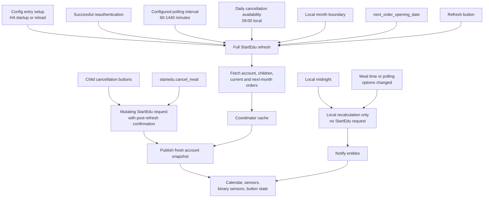

# Synchronization Strategy

StartEdu meal plans are monthly, so the integration should avoid frequent
automatic polling. The default automatic polling interval is one day, with one
additional daily morning refresh for same-day cancellation availability.

## Refresh Flow

The key rule is that only selected triggers fetch StartEdu again. Daily rollovers
and meal time changes only recalculate Home Assistant entities from the cached
StartEdu snapshot.



## Automatic Refresh

The coordinator refreshes StartEdu data:

- when the config entry is first set up;
- on Home Assistant startup or config entry reload;
- after successful reauthentication;
- on the configured polling interval, defaulting to `1440` minutes;
- once each morning at `09:00` local time to refresh today's cancellation
  availability;
- at the local month boundary;
- on the next future `next_order_opening_date` exposed by StartEdu;
- after a successful mutating action, such as meal cancellation.

The configurable polling interval is clamped between `60` and `1440` minutes.
This keeps advanced users in control while discouraging excessive StartEdu
requests.

The morning cancellation refresh exists because StartEdu does not expose a
separate cutoff timestamp. The integration can only know whether today's meal is
still cancellable by re-reading the order page and checking whether
`data-action="cancel-meal"` is still present.

## Local Recalculation

Some changes should update Home Assistant entities without fetching StartEdu:

- Today/tomorrow entity values are derived from the cached StartEdu snapshot and
  the current local date.
- At local midnight the coordinator notifies entities so today/tomorrow values
  roll over without fetching StartEdu.
- Same-day cancellation availability is not recalculated locally after the
  morning cutoff window, because that state comes from StartEdu page actions.
- Meal time option changes are applied locally. Calendar event times use the
  latest options, so changing lunch or snack time does not require StartEdu data
  to change.
- Updating options changes the coordinator polling interval and notifies
  entities without reloading the config entry.

## Manual Refresh

The integration exposes a single diagnostic button:

```text
button.<entry>_refresh_startedu_data
```

Pressing it requests a full coordinator refresh for the StartEdu account. The
refresh covers all child accounts and all currently discoverable relevant order
pages, including current and next-month data when StartEdu exposes it. Separate
current-month and next-month refresh buttons are intentionally not exposed,
because a single full refresh avoids mixed stale/fresh states.
