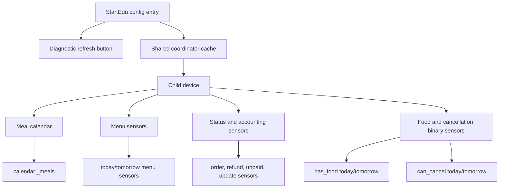
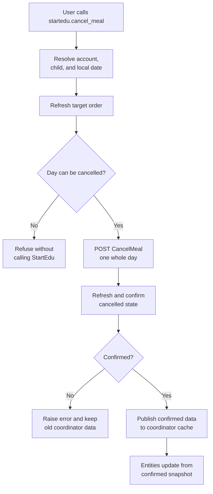

# Home Assistant Entities

Each StartEdu child is represented as a separate Home Assistant device. See
`docs/home-assistant-entity-model.md` for the source specification.

## Entity Map



## Calendar

- `calendar.<child>_meals`: meal slots as calendar events.

Cancelled meal events use a localized summary prefix because Home Assistant
calendar events do not expose a native cancelled/status field. The original
StartEdu meal label is kept unchanged, for example `CANCELLED: Obiad` in English
or `ODWOŁANE: Obiad` in Polish. Event descriptions contain only normalized menu
text. Unknown Home Assistant languages fall back to English.

## Sensors

- `sensor.<child>_today_menu`
- `sensor.<child>_tomorrow_menu`
- `sensor.<child>_today_meal_status`
- `sensor.<child>_tomorrow_meal_status`
- `sensor.<child>_last_successful_update`
- `sensor.<child>_current_month_order_status`
- `sensor.<child>_next_month_order_status`
- `sensor.<child>_refund_available`
- `sensor.<child>_unpaid_amount`
- `sensor.<child>_next_order_opening_date`

Menu attributes include localized `status` values for display and stable
`status_code` values for automations. Meal attributes intentionally avoid raw
StartEdu HTML, cookies, credentials, and internal child/meal identifiers.

## Binary Sensors

- `binary_sensor.<child>_has_food_today`
- `binary_sensor.<child>_has_food_tomorrow`
- `binary_sensor.<child>_can_cancel_today_meal`
- `binary_sensor.<child>_can_cancel_tomorrow_meal`
- `binary_sensor.<child>_next_month_ordering_available`

## Buttons

- `button.<entry>_refresh_startedu_data`

The refresh button is diagnostic and user-triggered. It requests a full StartEdu
coordinator refresh for the configured account rather than refreshing current
and next-month data separately.

Entity names may vary based on Home Assistant's entity registry and translation
handling.

## Cancellation Service

The first mutating interface is an explicit service call:

```text
startedu.cancel_meal
```

It targets one child and one local date. Before calling StartEdu, the integration
refetches the target order and verifies that the day still exposes `can_cancel`.
After a successful `CancelMeal` response, the coordinator is updated only after
the refreshed day is `cancelled`, shows `Rezygnacja`, and no longer exposes the
cancel action.



Potentially friendlier service targeting is tracked in issue #23. Entity buttons
for today/tomorrow cancellation should remain out of scope unless a separate
safety design proves they are appropriate.
