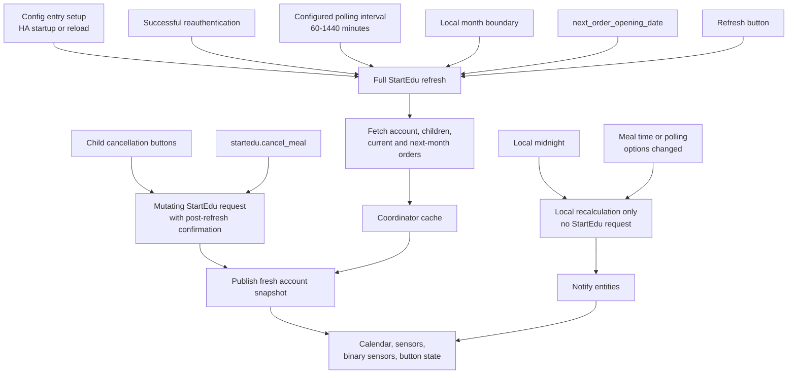

# Synchronization Strategy

StartEdu meal plans are monthly, so the integration avoids frequent automatic
polling. The default automatic refresh interval is one day.

## Refresh Flow

The key rule is that only selected triggers fetch StartEdu again. Daily rollovers
and meal time changes only recalculate Home Assistant entities from the cached
StartEdu snapshot.



## Automatic Refresh

The coordinator refreshes StartEdu data when the config entry is set up, on
Home Assistant startup or reload, after successful reauthentication, on the
configured polling interval, at the local month boundary, on the next future
`next_order_opening_date` exposed by StartEdu, and after successful mutating
actions such as meal cancellation.

The polling interval is configurable and clamped between `60` and `1440`
minutes.

## Local Recalculation

Today/tomorrow entities and calendar event times are derived from cached StartEdu
data plus local Home Assistant state. At local midnight, the coordinator
notifies entities without fetching StartEdu. Changing meal time options updates
the coordinator interval and notifies entities without reloading the config
entry or fetching StartEdu.

## Manual Refresh

The integration exposes one diagnostic refresh button:

```text
button.<entry>_refresh_startedu_data
```

It requests a full coordinator refresh for the StartEdu account, including all
child accounts and current/next-month data when StartEdu exposes it. Separate
current-month and next-month refresh buttons are intentionally not exposed.
